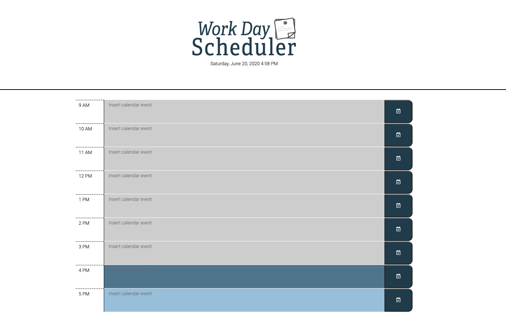

# 5-work-day-scheduler

This application is a simple calendar application that allows the user to save events for each hour of the workday between 9 AM and 5 PM. 

## Table of Contents
- [Overview](#Overview)
- [Notes](#Notes)
- [Credits](#Credits)

### Overview
This application is a simple calendar application that allows the user to save events for each hour of the workday between 9 AM and 5 PM. This application runs in the browser and features dynamically updated HTML and CSS powered by jQuery.

### Notes

Instructions:
1. When the user opens the browser they will see their current date and time displayed, along with timeblocks for the hours between 9 AM and 5 PM.
2. Each timeblock is color coded to differentiate which is the past (gray), present (blue), or future (light blue).
3. The user is able to click any timeblock, enter events for that hour of time, and press the save button (a check calendar icon). When the user refreshes the page their events will persist.

CSS
- The CSS is linked using an external style sheet and utilizes Bootstrap.

JavaScript
- The JavaScript is linked using an external script and utilizes jQuery and the Moment.js library.

### Credits
Created by @aflavors. Feel free to contact me! :v: